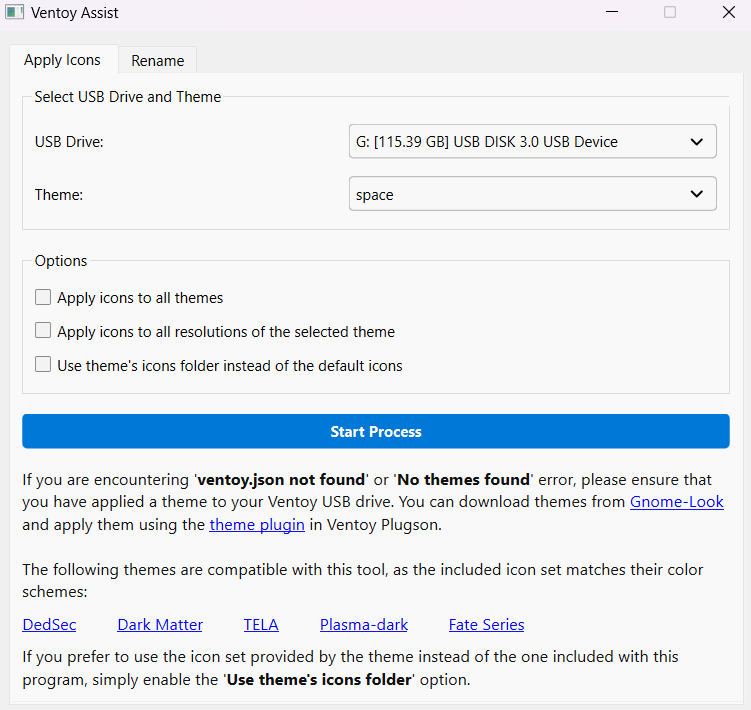
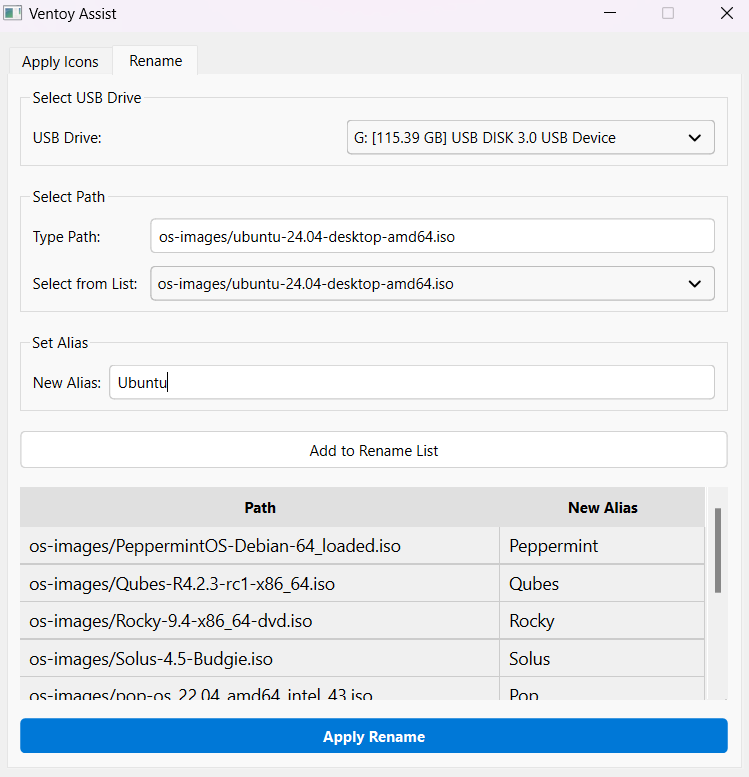
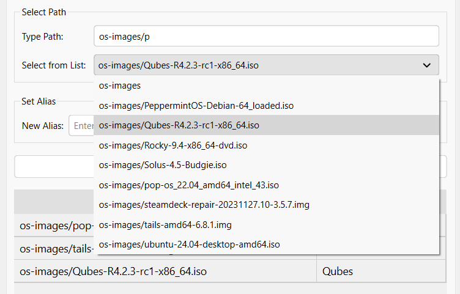
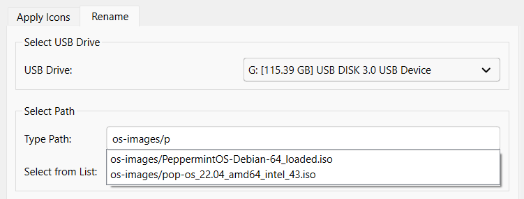
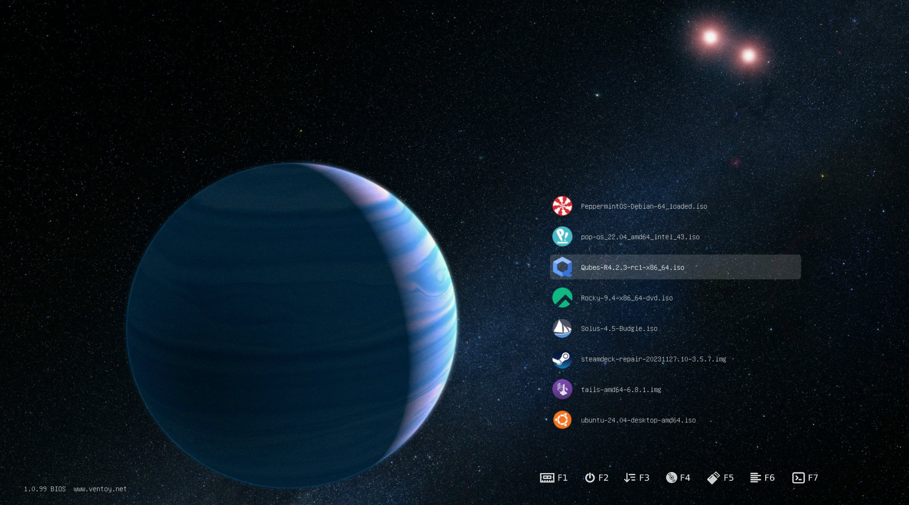

# ventoy-assist

**ventoy-assist** is an utility that allows you to automatically apply icons to image files on your Ventoy USB drive. You can choose icons from your selected theme or use the 70+ OS icons included with the program. Additionally, ventoy-assist provides an alternative interface for renaming files and folders which offers a more user-friendly experience compared to Ventoy's Menu Alias Plugin.

You can download the program [here](https://github.com/LunarEclipseCode/ventoy-assist/releases).

<div align="center">
Apply Icons Tab
</div>



<div align="center">
Rename Tab
</div>



## Features

- **Supports multiple resolutions**: Recognizes resolution syntax and can apply icons for multiple resolutions of a theme at once. 
  
  ```json
  "file": [
      "/ventoy/themes/theme_800x600/theme.txt",
      "/ventoy/themes/theme_1024x768/theme.txt",
      "/ventoy/themes/theme_1600x900/theme.txt"
  ]
  ```

- **Better renaming UI**: Provides an easier way to rename files and folders with dropdowns and autocomplete suggestions.





## Prerequisites

- Before using ventoy-assist, you need to apply a theme using the [theme plugin](https://www.ventoy.net/en/plugin_theme.html) in Ventoy Plugson. 

## Demo

The following theme is a modified version of the [TELA](https://www.gnome-look.org/p/1307852) theme. The image can be found [here](https://unsplash.com/photos/an-artists-rendering-of-a-planet-with-a-star-in-the-background-ToqSfkX4AW4). The sources of the icons are mentioned in [icon-sources](https://github.com/LunarEclipseCode/ventoy-assist/blob/main/icon-sources.txt).



## Compatible Themes

The following themes are compatible with ventoy-assist i.e. the included icon set matches the color schemes of these themes:

- [DedSec](https://www.gnome-look.org/p/1569525)
- [Dark Matter](https://www.gnome-look.org/p/1603282)
- [TELA](https://www.gnome-look.org/p/1307852)
- [Plasma-dark](https://www.gnome-look.org/p/1195799)
- [Fate Series](https://www.gnome-look.org/p/1850334)

## Notes

- **Preserving original icons**: If you're not using the theme's icon folder and an icon like `ubuntu.png` already exists in the icons folder, ventoy-assist will name the new icon `ubuntu-alt.png` to preserve the original. However, If `ubuntu-alt.png` already exists, the program will overwrite it with the new icon.
- **Conflict resolution**: When applying icons across multiple resolutions or multiple themes, the icons folder across those themes should have matching file names. The actual resolution of the icons doesn't need to match across different themes and their resolution variants.
- If you first apply the included icons on one resolution of a theme and later decide to apply them across all resolutions, ventoy-assist will handle this correctly, even if there's currently a mismatch in icon folder contents.

### Creating the .exe file

To create the .exe file, first download the latest version of [upx](https://github.com/upx/upx) and unzip it. Then run:

```
python -m venv venv
venv\Scripts\activate
pip install -r requirements.txt
pip install pyinstaller
pyinstaller --windowed --onefile --hidden-import=skimage.filters.rank.core_cy --exclude PyQt5 --upx-dir="./upx-4.2.4-win64" --add-data "./resources;./resources" .\ventoy-assist.py
deactivate
```

Note that for virtual environment, you don't really need the `--exclude PyQt5` part but if you are not using a virtual environment and you have both PyQt5 and PyQt6 installed, you have to add the `--exclude PyQt5` flag to create the .exe file.